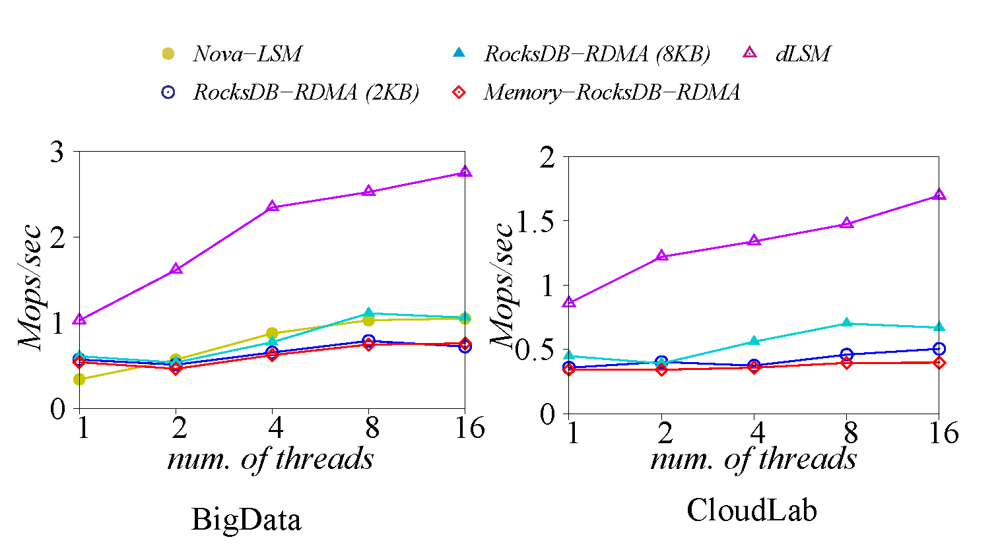
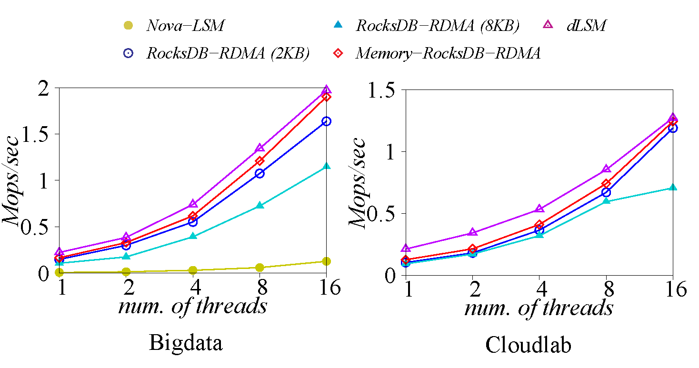

# dLSM: An LSM-Based Index for Memory Disaggregation

dLSM is the first purpose-built LSM-based indexing system for the emerging disaggregated memory DBMSs. dLSM develops a series of optimizations to address the performance challenges. dLSM significantly reduces the software overhead (e.g., the overhead of synchronizing the in-memory write and flushing), to unlock the full potential of the fast RDMA networking. dLSM offloads the LSM-tree compaction to the remote memory node, and addresses a number of follow-up issues (e.g., RPC and garbage collection) to significantly reduce the data movement. dLSM is tuned to deprecate the concept of block structures to leverage the byte-addressability in RDMA-enabled disaggregated memory. Finally, dLSM optimizes the RDMA communication channel including customized RPC, asynchronous RDMA I/O, and optimized thread local queue pairs.


## Highlights 
* 1.8× ∼ 11.7× faster than disaggregated b-tree in pure write workload.
* 1.6× ∼ 3.9× faster than adaptations of existing LSM-tree indexes over disaggregated memory in pure write workload.
* Comparable performance to disaggregated b-tree in pure read and read intensive workloads.

## Usage
* Keys and values are arbitrary byte arrays.
* Data is stored sorted by key.
* The basic operations are `Put(key,value)`, `Get(key)`, `Delete(key)`.
* Users can create a transient snapshot to get a consistent view of data.
* Forward iteration is supported over the data.
## Getting the Source
```bash
git clone --recurse-submodules https://github.com/ruihong123/dLSM
```
## Building
This project supports CMake out of the box.
### Build for POSIX

```bash
mkdir -p build && cd build
cmake -DWITH_GFLAGS=1 -DCMAKE_BUILD_TYPE=Release .. && make Server db_bench dLSM
```
### How to run
* Memory node side: 
```bash
./Server TCPIPPORT MEMORYSIZE NODEID 
```
* Compute node side: 
To run the benchmark:
```bash
./db_bench --benchmarks=fillrandom,readrandom,readrandom,readrandomwriterandom --threads=1 --value_size=400 --num=100000000 --bloom_bits=10 --readwritepercent=5 --compute_node_id=0 --fixed_compute_shards_num=0
```
To utilize dLSM in your code, you need refer to public interface in **include/dLSM/\*.h** .
```bash
YourCodeOverdLSM
```
## Performance

Here is a performance report from the run of the
"fillrandom", "readrandom" and "readseq" included in the "db_bench" under benchmarks folder.  

### Setup

We test a database with a 100 million entries.  Each entry has a 20 byte 
key, and a 400 byte value.  We conduct the experiments on two platforms with 
different types of RDMA fabrics: the BigData testbed and CloudLab testbed. The 
BigData testbed consists of two servers: The compute node has a Xeon Platinum 8168
CPU (24 cores, 2.7GHz) and the memory node has 3TB of DRAM, connected by an RDMA-enabled 
Mellanox EDR Connectx-5 NIC with a bandwidth of 100Gb/s. Eachnode runs Ubuntu 18.04.5. 
The CloudLab testbed also contains two servers with the instance type of c6220. 
Each c6220 node containstwo Xeon E5-2650v2 processors (8 cores each, 2.6GHz) and 64GB 
Memory. The nodes are connected by an RDMA-enabled MellanoxFDR Connectx-3 NIC with 
a bandwidth of 56Gb/s. Each node runsUbuntu 18.04.1

### Baseline
We compare dLSM against the baseline solutions that directly port RocksDB to the RDMA-extended remote memory, namely, **RocksDB-RDMA (8KB)**. Besides,  to better leverage the byte-addressability of the remote memory, we choose 2KB and term this baseline **RocksDB-RDMA (2KB)**. Furthermore, an RocksDB baseline with the block size of a key-value pair is tested and termed as **Memory-RocksDB-RDMA**. Another baseline is **Nova-LSM** that is an optimized LSM-tree for storage disaggregation (instead ofmemory disaggregation).  We make it running on tmpfs to make the comparison fair.

### LSM-tree Configurations
We set the same parameters of dLSM and other baseline solutions. The SSTable file size is set to 64MB andthe bloom filters key size is set to 10 bits. For in-memory buffers,the MemTable size is set to 64MB. We set 12 and 4 backgroundthreads for compaction and flushing, respectively. The number of immutable tables is set to 10 to fully utilize the background flushing threads. To accelerate compaction further, subcompaction is enabled with 12 workers. These parameters are largely consistent with RocksDB’s settings. For Nova-LSM, the subrange is set to 64 to maximize concurrency in background compaction.

### Write performance

The "fillrandom" benchmarks create a brand new database, in a random order.  

The throughput of the system is shown as below.

Bigdata:

    | Thread number | 1            | 2            | 4            | 8            | 16           |
    | Throughput    | 1.03Mops/sec | 1.61Mops/sec | 2.34Mops/sec | 2.52Mops/sec | 2.75Mops/sec |

<!-- | :------------ | :------------ | :------------ | :------------ | :------------ | :------------ | -->
CloudLab:

    | Thread number | 1            | 2            | 4            | 8            | 16           |
    | Throughput    | 0.86Mops/sec | 1.22Mops/sec | 1.34Mops/sec | 1.47Mops/sec | 1.69Mops/sec |

<!-- | :------------ | :------------ | :------------ | :------------ | :------------ | :------------ | -->

* Compared to baselines

<!--  -->



### Read performance

The "readrandom" benchmarks run 100 million random key-value queries and report the throughput as below.

Bigdata:

    | Thread number | 1            | 2            | 4            | 8            | 16           |
    | Throughput    | 0.22Mops/sec | 0.39Mops/sec | 0.74Mops/sec | 1.34Mops/sec | 1.97Mops/sec |
<!-- | :------------ | :------------ | :------------ | :------------ | :------------ | :------------ | -->


CloudLab:

    | Thread number | 1            | 2            | 4            | 8            | 16           |
    | Throughput    | 0.21Mops/sec | 0.34Mops/sec | 0.53Mops/sec | 0.85Mops/sec | 1.27Mops/sec |

<!-- | :------------ | :------------ | :------------ | :------------ | :------------ | :------------ | -->


* Compared to baselines:
    
<!--  -->


### Table scan performance

The "readseq" benchmarks scan the whole data range by a single thread and report the throughput as below.

Bigdata: 7.24Mops/sec

CloudLab: 4.12Mops/sec

* Compared to baselines:
    
<!--  -->


## Repository contents

Guide to header files:

* **include/dLSM/db.h**: Main interface to the DB: Start here.

* **include/dLSM/comparator.h**: Abstraction for user-specified comparison function.
  If you want just bytewise comparison of keys, you can use the default
  comparator, but clients can write their own comparator implementations if they
  want custom ordering (e.g. to handle different character encodings, etc.).

* **include/dLSM/iterator.h**: Interface for iterating over data. You can get
  an iterator from a DB object.


* **include/dLSM/slice.h**: A simple module for maintaining a pointer and a
  length into some other byte array.

* **include/dLSM/status.h**: Status is returned from many of the public interfaces
  and is used to report success and various kinds of errors.


* **include/dLSM/table.h, include/dLSM/table_builder.h**: Lower-level modules that most
  clients probably won't use directly.
