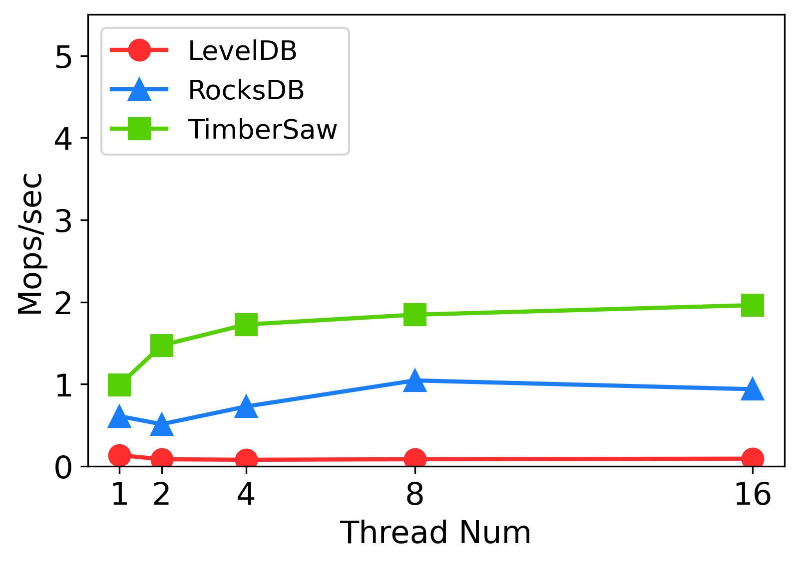
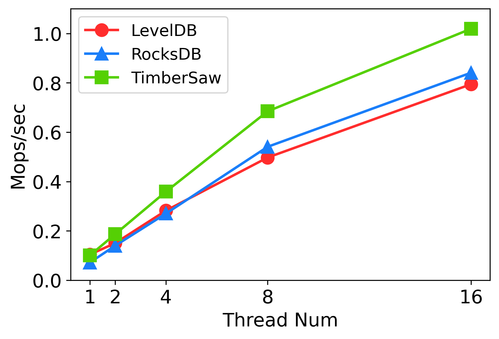
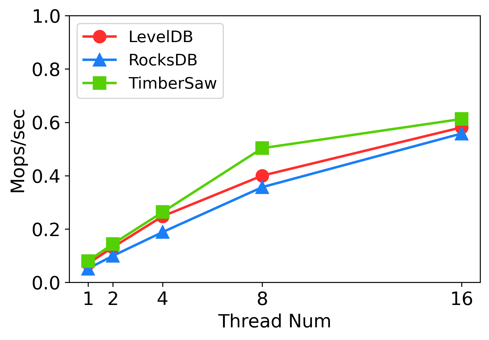

# dLSM: An LSM-Based Index for Memory Disaggregation

dLSM is the first purpose-built LSM-based indexing system for the emerging disaggregated memory DBMSs. dLSM borrows from LevelDB, but it develops a series of optimizations to address the performance challenges. dLSM significantly reduces the software overhead (e.g., the overhead of synchronizing the write queue and flushing), to unlock the full potential of the fast RDMA networking. dLSM offloads the LSM-tree compaction to the remote memory node, and addresses a number of follow-up issues (e.g., consistency and garbage collection) to significantly reduce the data movement. dLSM optimizes the RDMA communication channel including customized RPC, asynchronous RDMA I/O, and optimized thread local queue pairs.


## New Features
* Write queue removal
* Optimistic Memtable switching.
* Asynchronous flushing.
* Near-data compaction.
* Byte-addressable SSTable
* RDMA specific optimizations.

## Usage
* Keys and values are arbitrary byte arrays.
* Data is stored sorted by key.
* The basic operations are `Put(key,value)`, `Get(key)`, `Delete(key)`.
* Users can create a transient snapshot to get a consistent view of data.
* Forward iteration is supported over the data.
## Getting the Source
```bash
git clone --recurse-submodules https://github.com/ruihong123/dLSM
```
## Building
This project supports CMake out of the box.
### Build for POSIX

```bash
mkdir -p build && cd build
cmake -DWITH_GFLAGS=1 -DCMAKE_BUILD_TYPE=Release .. && make Server db_bench dLSM
```
### How to run
* Memory node side: 
```bash
./Server
```
* Compute node side: 
To run the benchmark:
```bash
./db_bench --benchmarks=fillrandom,readrandom,readwhilewriting --threads=1 --value_size=400 --key_size=20 --num=100000000 < MemoryNodeIP
```
To utilize dLSM in your code, you need refer to public interface in **include/dLSM/\*.h** .
```bash
YourCodeOverdLSM < MemoryNodeIP
```
## Performance

Here is a performance report from the run of the
"fillrandom" and "readrandom" included in the "db_bench" under benchmarks folder.  

### Setup

We test a database with a 100 million entries.  Each entry has a 20 byte 
key, and a 400 byte value.  We conduct the experiments on two platforms with 
different types of RDMA fabrics: the BigData testbed andCloudLabtestbed4. The 
BigDatatestbed consists of two servers: The compute node has a Xeon Platinum 8168
CPU (24 cores, 2.7GHz) and the memory node has 3TB of DRAM, connected by an RDMA-enabled 
Mellanox EDR Connectx-5 NIC with a bandwidth of 100Gb/s. Eachnode runs Ubuntu 18.04.5. 
The CloudLab testbed also contains two servers with the instance type of c6220. 
Each c6220 node containstwo Xeon E5-2650v2 processors (8 cores each, 2.6GHz) and 64GB 
Memory. The nodes are connected by an RDMA-enabled MellanoxFDR Connectx-3 NIC with 
a bandwidth of 56Gb/s. Each node runsUbuntu 18.04.1

### Baseline
We compare dLSM against the baseline solutions that directly port LevelDB and RocksDB to the RDMA-extended remote memory, namely, LevelDB over RDMA file system and RocksDB over RDMA file system.

### LSM-tree Configurations
We set the SSTable file size as 64MB with byte-addressable table format. We also set
10 bits per key for the Bloom filters. For the in-memory buffer, the MemTable size is
set to 64MB. We set 12 background compaction threads and 4 background threads for flushing.
We set the number of immutable tables to 10 to fully utilize the background flushing threads.

### Write performance

The "fillrandom" benchmarks create a brand new database, in a random order.  

The throughput of the system is shown as below.

Bigdata:

    | Thread number | 1            | 2            | 4            | 8            | 16           |
    | Throughput    | 0.99Mops/sec | 1.47Mops/sec | 1.72Mops/sec | 1.84Mops/sec | 1.96Mops/sec |

<!-- | :------------ | :------------ | :------------ | :------------ | :------------ | :------------ | -->
CloudLab:

    | Thread number | 1            | 2            | 4            | 8            | 16           |
    | Throughput    | 0.86Mops/sec | 1.27Mops/sec | 1.30Mops/sec | 1.48Mops/sec | 1.67Mops/sec |

<!-- | :------------ | :------------ | :------------ | :------------ | :------------ | :------------ | -->

* Compared to baselines
Bigdata:
<!--  -->


CloudLab:
<!--  -->

### Read performance

The "readrandom" benchmarks run 100 million random key-value queries and report the throughput as below.

Bigdata:

    | Thread number | 1            | 2            | 4            | 8            | 16           |
    | Throughput    | 0.10Mops/sec | 0.19Mops/sec | 0.36Mops/sec | 0.68Mops/sec | 1.01Mops/sec |
<!-- | :------------ | :------------ | :------------ | :------------ | :------------ | :------------ | -->


CloudLab:

    | Thread number | 1            | 2            | 4            | 8            | 16           |
    | Throughput    | 0.08Mops/sec | 0.14Mops/sec | 0.26Mops/sec | 0.50Mops/sec | 0.61Mops/sec |

<!-- | :------------ | :------------ | :------------ | :------------ | :------------ | :------------ | -->


* Compared to baselines:
    
Bigdata:
<!--  -->


CloudLab:
<!--  -->


## Repository contents

Guide to header files:

* **include/dLSM/db.h**: Main interface to the DB: Start here.

* **include/dLSM/comparator.h**: Abstraction for user-specified comparison function.
  If you want just bytewise comparison of keys, you can use the default
  comparator, but clients can write their own comparator implementations if they
  want custom ordering (e.g. to handle different character encodings, etc.).

* **include/dLSM/iterator.h**: Interface for iterating over data. You can get
  an iterator from a DB object.


* **include/dLSM/slice.h**: A simple module for maintaining a pointer and a
  length into some other byte array.

* **include/dLSM/status.h**: Status is returned from many of the public interfaces
  and is used to report success and various kinds of errors.


* **include/dLSM/table.h, include/dLSM/table_builder.h**: Lower-level modules that most
  clients probably won't use directly.
